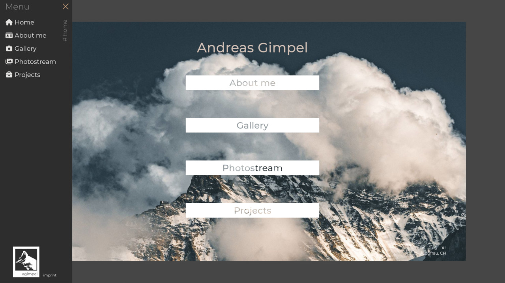

# agimpel.com

Personal website hosted on [agimpel.com](https://agimpel.com), powered by Django and deployed with Docker.




## Getting started locally

After cloning the repository and installing the required Python packages, create the database with
``` bash
python manage.py makemigrations && python manage.py migrate
```

Then create an admin account via
``` bash
python manage.py createsuperuser
```

Set up environment variables with
``` bash
export DJANGO_KEY="YOUR_KEY"
export DJANGO_ALLOWED_HOSTS="localhost"
```

Finally start the development server with
``` bash
python manage.py runserver
```

and navigate to the admin panel at `localhost:8000/admin`.


## Deploy

It is recommended to set up a database using the local install (see above) before proceeding to deploy. In any case, this setup assumes the presence of a reverse proxy, such as [nginx-proxy](https://github.com/nginx-proxy/nginx-proxy). First, edit the environment file [.env](.env) to set up the correct variables. Then, build the Docker container and start the service via docker compose:
``` bash
docker compose --env-file .env up -d
```
The initial build will take a few minutes.